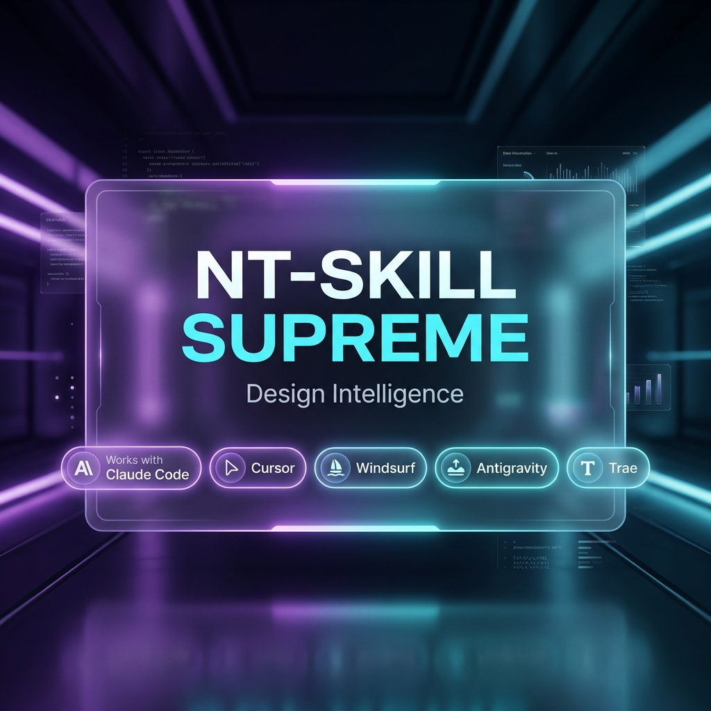

# 👑 NT-SKILL SUPREME

<p align="center">
  <a href="./README.es.md">es Español</a> | <b>us English</b>
</p>

<p align="center">
  
  
  
  
  
  
</p>

<p align="center">
  <b>The Master AI Skill Framework providing contextual design intelligence, micro-interactions, 3D physics, grounded 2026 CRO, and rapid agency web production across all modern AI platforms.</b>
</p>

<p align="center">
  
</p>

---

## ⚡ Multi-AI Safe CLI Installation

Install **NT-SKILL SUPREME** safely across all your AI assistants using our atomic, manifest-driven CLI installer:

### 🌟 Universal Auto-Detection (Safe Default)
Automatically scans your system for active AI environment signatures and installs only to detected platforms:
```bash
npx nt-skill-supreme init
```

### 🎯 Targeted Platform Commands

| Target AI Assistant | Terminal Command | Installation Route |
|---|---|---|
| **Google Gemini Antigravity** | `npx nt-skill-supreme init --ai antigravity` | `~/.gemini/config/skills/nt-skill-supreme` |
| **Claude Code & Desktop** | `npx nt-skill-supreme init --ai claude` | `~/.claude/skills/nt-skill-supreme` |
| **Cursor Editor** | `npx nt-skill-supreme init --ai cursor` | `.cursor/rules/nt-skill-supreme.mdc` |
| **Windsurf IDE** | `npx nt-skill-supreme init --ai windsurf` | `.windsurfrules` |
| **Trae IDE** | `npx nt-skill-supreme init --ai trae` | `AGENTS.md` |
| **Codex CLI** | `npx nt-skill-supreme init --ai codex` | `.codex/rules/AGENTS.md` |
| **OpenCode** | `npx nt-skill-supreme init --ai opencode` | `AGENTS.md` |

### 🛡️ Safety Flags & Management Commands
- **Dry Run Simulation** (modifies zero disk files):  
  `npx nt-skill-supreme init --dry-run`
- **Safe Overwrite with Automatic Backups** (`.bak.[timestamp]`):  
  `npx nt-skill-supreme init --force`
- **Inspect Installation Manifest**:  
  `npx nt-skill-supreme status`
- **Atomic Manifest-Driven Uninstall**:  
  `npx nt-skill-supreme remove`

---

## 🎨 Contextual Visual Profiles

Adapt design intensity dynamically to match project objectives:

- **`minimal`**: Refined, editorial cleanliness, typography cadence, whitespace rhythm, subtle motion, zero neon/glow clutter. *(Ideal for luxury, legal, blogs, executive portfolios).*
- **`balanced`** *(Default)*: Premium aesthetic, tactile micro-interactions, moderate depth, WCAG AA contrast, smooth spring physics. *(Ideal for SaaS, agency sites, clinics, local services).*
- **`supreme`**: High visual impact, 3D perspective hover tilt, spotlight tracking, native scroll-driven animations, parallax depth. *(Ideal for product launches, web experiences, tech portfolios).*

---

## 💥 The Real Transformation: Before vs After

Why do websites generated with **NT-SKILL SUPREME** convert and amaze clients on first sight?

| UX / UI Feature | ❌ Without Skill (Standard AI Generation) | 🚀 With NT-SKILL SUPREME |
|---|---|---|
| **Design & Palettes** | Plain white background, default `#3b82f6` blue buttons ("AI Slop") | Adaptive dark/light HSL palettes, glassmorphism `backdrop-blur-md`, ambient glows |
| **Click Feedback** | Static buttons/cards, no tactile feedback on press | Instant tactile press response `:active scale(0.96)` at 100ms |
| **Hover & Cursor** | Flat static cards without depth | Dynamic **3D Card Hover Tilt** following fine pointer with specular glare highlights |
| **Scroll Animations** | Zero motion or heavy JS libraries causing lag | Fluid, native GPU-accelerated CSS `animation-timeline: view()` reveals |
| **CRO Psychology** | Long boring forms and ungrounded marketing stats | 3-Second value rule, near-CTA social proof, zero fake data, streamlined lead capture |
| **Images & Fallbacks** | Broken text boxes like `[Insert Image]` | Photorealistic AI assets, user assets, or graceful Unsplash/SVG fallbacks |
| **Codebase Respect** | Rewrites existing frameworks blindly | Inspects & elevates active tech stacks (React, Vue, Tailwind, Shadcn) in-place |

---

## 🛠 Direct Commands & Agency Workflows

| Command | Action |
|---|---|
| `/build-client-site [niche] [--style minimal\|balanced\|supreme]` | **Rapid Agency Engine**: Generates a complete, multi-section client site in a single HTML file (Dental, Gym, Law, Restaurant, Agency, SaaS, E-Commerce). |
| `/add-section [type]` | Injects a production-ready section (Sticky Header, Floating WhatsApp, Pricing Switch, Accordion FAQ, Lead Capture Form). |
| `/rapid-localize` | Replaces placeholders with client-specific brand name, phone number, WhatsApp link, and local address. |
| `/design-audit` | Perform a visual hierarchy, accessibility, code hygiene, and slop scan of your current frontend components. |
| `/polish-ui [--style minimal\|balanced\|supreme]` | Elevate existing components with smooth transitions, refined typography, and glassmorphic depth. |

---

## 📁 Repository Structure

```
nt-skill-supreme/
├── assets/
│   └── banner.png                    # Official Showcase Hero Banner Image
├── tests/
│   └── cli.test.js                   # Automated CLI Test Suite (node --test)
├── SKILL.md                          # Primary skill definition (YAML frontmatter + system instructions)
├── AGENTS.md                         # Rules for Cursor, Trae, Windsurf, OpenCode & Codex
├── AUDIT.md                          # Comprehensive Audit & Architecture Assessment
├── CHANGELOG.md                      # Version history (Semantic Versioning 2.0.0)
├── references/                       # Master technical reference manuals
│   ├── niche-blueprints.md           # Commercial industry blueprints & conversion funnels
│   ├── component-blueprints.md       # Drop-in code snippets (Navbar, Hero, FAQs, WhatsApp Float)
│   ├── cro-and-performance.md        # 3-Second value rule, mobile ergonomics, Core Web Vitals
│   ├── motion-and-physics.md         # Scroll-driven CSS animations, 3D tilt & spring physics
│   ├── image-gen-and-fallbacks.md    # AI photo generation protocol & Unsplash/SVG fallbacks
│   ├── taste-anti-slop.md            # Zero-slop & palette generation guide
│   ├── ui-ux-wcag.md                 # UI/UX grids & WCAG accessibility rules
│   └── craft-and-polish.md           # Visual QA & design audit manual
├── bin/cli.js                        # Multi-AI universal installer CLI script
└── .claude-plugin/plugin.json        # Claude Desktop & Claude Code plugin metadata
```

---

## 🧪 Running Tests & Quality Verification

Run the automated test suite locally:
```bash
npm test
```

Inspect help banner and options:
```bash
npm run lint
```

---

## 📄 License
Released under the [MIT License](LICENSE). Copyright (c) 2026 NachoTorresRD.
